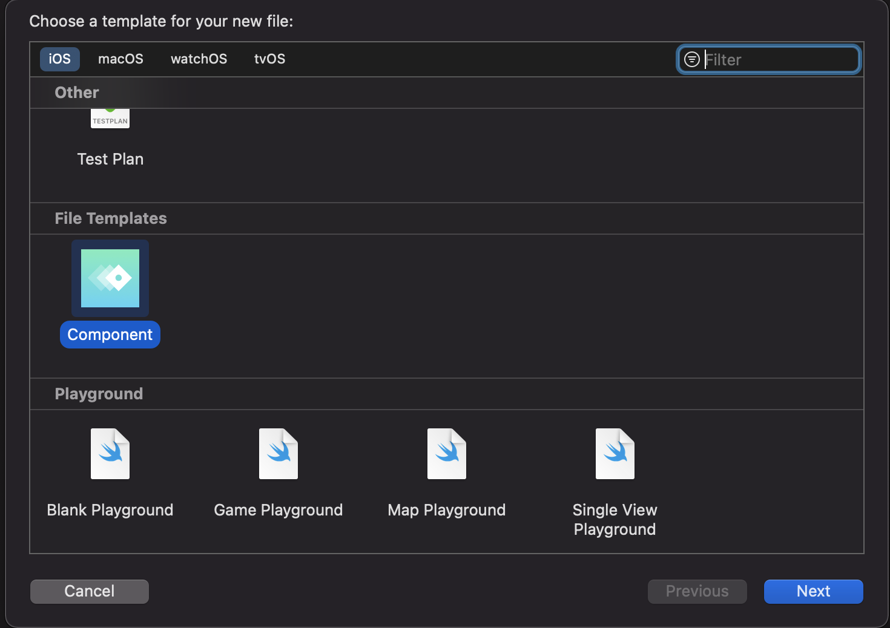
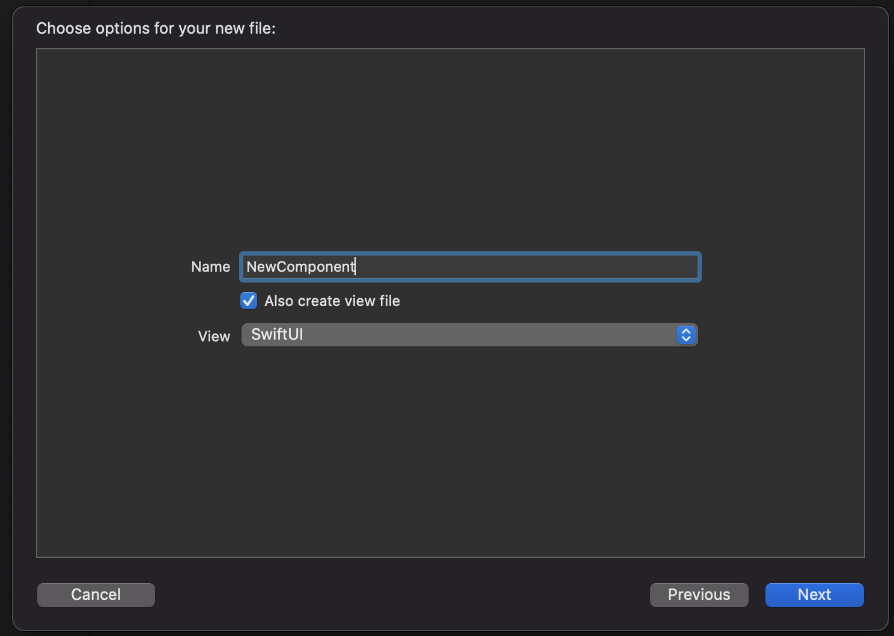

# template-composable-architecture

A simple template for The Composable Architecture using Xcode

## Instructions

Copy the template in ~/Library/Developer/Xcode/Templates/File Templates
If no exist this folder, you will need create, Template and File Templates folders.

After that, open a project and go to New File

You can select if you want files for SwiftUI or UIKit

!

Notice that my idea is to create this files in a custom framework for a component.

That's all. 

## More information

[The Composable Architecture](https://github.com/pointfreeco/swift-composable-architecture).